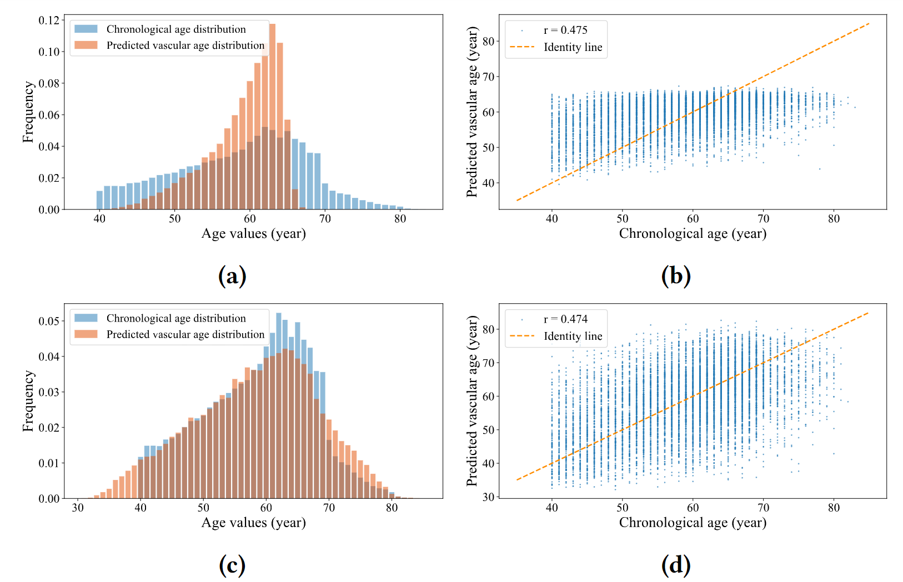

# Deep Imbalanced Regression to Estimate Vascular Age from PPG Data: A Novel Digital Biomarker for Cardiovascular Health

## Introduction
Welcome to our repository where we provide the PyTorch implementation of the **Dist loss**. This loss function, described in detail [here](https://arxiv.org/abs/2406.14953), leverages data distribution priors to effectively address deep imbalanced regression tasks, such as estimating vascular age from PPG data.

The below figure shows the effectiveness of the **Dist loss** in tackling deep imbalanced regression tasks. (a) and (b) are the results generated by the model using solely L1 loss (similar performance when use MSELoss), while (c) and (d) are the results generated by the model using the Dist loss during training stage. 

## Usage
To illustrate the usage of the **Dist loss**, we have included a straightforward example in the `example.ipynb` notebook, which demonstrates its application in a synthetic regression task. When utilizing this loss function, several key parameters must be carefully considered:

1. **`batch_size`**: Setting a very small batch size can degrade performance because such sizes are inadequate for reliably estimating the distribution of model outputs. A practical solution is to calculate the loss values over multiple batches or at the end of each epoch if your data or hardware does not support larger batch sizes.

2. **`step`**: This parameter defines the interval between discrete labels in the estimated distribution. For instance, in age estimation, a step value of 1 is appropriate, whereas a value like 10,000 might be suitable for predicting house prices. The step size directly impacts the granularity of your task.

3. **`min_label` and `max_label`**: These parameters define the theoretical range of possible labels. Any label values falling below `min_label` or above `max_label` will be assigned a probability of zero in the output distribution. Importantly, these are not merely the minimum and maximum values present in your dataset. For example, with a dataset ranging from 40 to 80 years in age, `min_label` and `max_label` might be set to 20 and 100 years, respectively.

4. **`drop_last`**: This parameter should be set to True in your training set to avoid mismatched tensor shapes, which can lead to errors.
